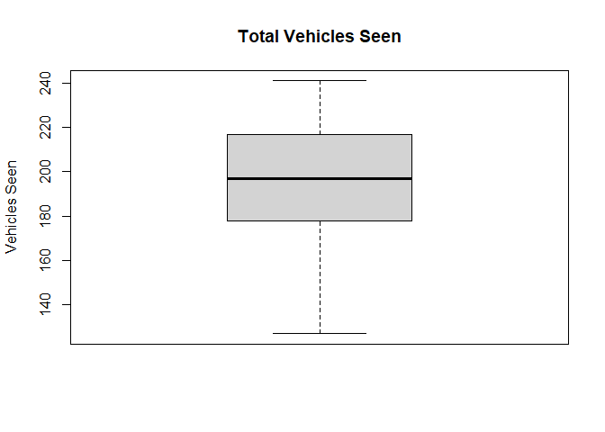

<!-- README.md is generated from README.Rmd. Please edit that file -->

# workflowr2

<!-- badges: start -->

<!-- badges: end -->

The goal of workflowr2 is to take data that overviews the number and
status of customer appointments along with data of technician workflow
and analyze them together and provide visuals.

## Installation

You can install the released version of workflowr2 from
[CRAN](https://CRAN.R-project.org) with:

``` r
install.packages("workflowr2")
```

## Example

This is a basic example which shows you how to solve a common problem:

``` r
library(workflowr2)
## basic example code which shows the average total vehicle seen on a Monday in the shop
MeanAppt(ApptData$MonT)
#> [1] 32.38235
```

## Plot Example

This shows a box and whisker plot detailing the average amount of cars
we have seen and the high and low extremes over a seven month period.


